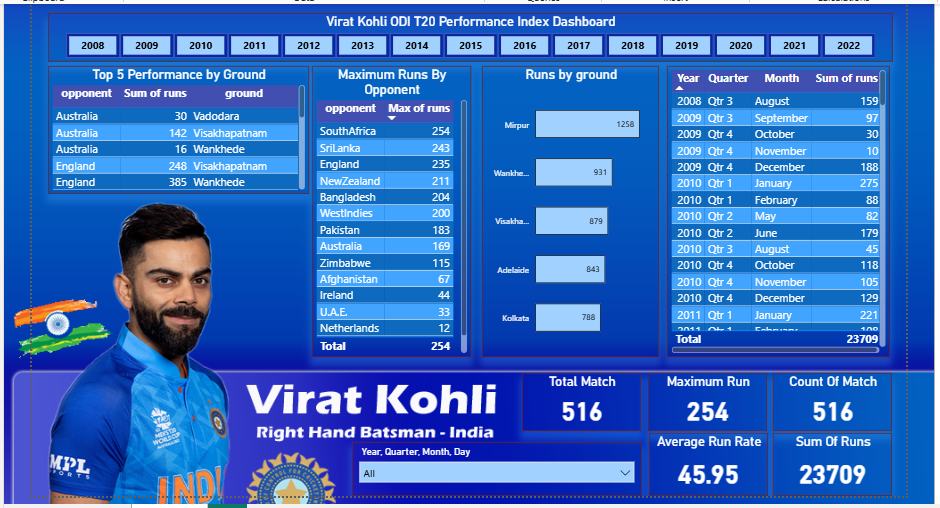

# 🏏 Virat Kohli ODI T20 Performance Analysis Dashboard

## 📌 Project Overview

This project is a **Power BI dashboard** that analyzes **Virat Kohli’s ODI T20 cricket performance** across different years, opponents, and grounds.
The dashboard provides interactive insights into runs scored, match performance, and trends over time.

---

## 🛠 Tools & Technologies Used

* **Power BI**
* **DAX (Data Analysis Expressions)**
* **Microsoft Excel / CSV (Data Source)**
* **Data Modeling & Visualization**

---

## 📊 Key Features & Analysis

* 📅 **Year-wise performance analysis** (2008–2022)
* 🌍 **Top 5 performance by ground**
* 🆚 **Maximum runs against opponents**
* 🏟 **Runs scored by different grounds**
* 📈 **KPIs included:**

  * Total Matches
  * Maximum Runs
  * Average Run Rate
  * Count of Matches
  * Total Runs
* 🔎 **Interactive slicers** (Year, Quarter, Month)
* 📊 Clean and visually engaging dashboard design

---

## 📷 Dashboard Preview



---

## 📂 Project Structure

```
Virat-Kohli-ODI-T20-PowerBI/
│
├── Virat_Kohli_Performance.pbix
├── dashboard.png
└── README.md
```

---

## 🎯 Insights Gained

* Identified **grounds where Virat Kohli performs best**
* Analyzed **opponents against whom he scored maximum runs**
* Observed **performance trends over different years**
* Calculated **average run rate and consistency metrics**

---

## 🚀 How to Use

1. Download the `.pbix` file
2. Open it using **Power BI Desktop**
3. Use slicers to explore data by **year, quarter, or month**
4. Interact with visuals for deeper insights

---

## 📌 Future Improvements

* Add **strike rate & centuries analysis**
* Include **match-winning performance metrics**
* Integrate **live or updated data**
* Compare performance with other players

---

## 👤 Author

**Shyam Sundar Pareek**
Aspiring Data Analyst | Power BI | SQL | Python
